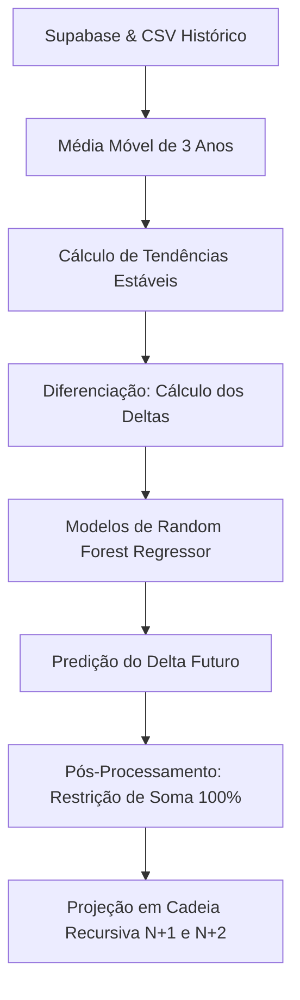

# Relatório Técnico de Engenharia de Machine Learning
## Sistema Preditivo Epidemiológico NutriAlerta
> *Projeto Interdisciplinar do 3º Semestre · FATEC Rio Claro · 2026 · Documentação de IA Avançada*

Este documento descreve detalhadamente a arquitetura de Inteligência Artificial e Aprendizado de Máquina desenvolvida para o ecossistema **NutriAlerta**. O modelo é projetado para predizer a evolução dos perfis nutricionais (Desnutrição, Magreza, Eutrofia, Sobrepeso e Obesidade) da população atendida pelas Unidades Básicas de Saúde (UBS) do município para os próximos dois anos, utilizando variáveis socioambientais, estruturais e epidemiológicas urbanas.

Este artefato técnico serve como documento oficial de referência para a equipe, bancas de avaliação e como base conceitual para alimentação futura de sistemas de RAG (*Retrieval-Augmented Generation*).

---

## 1. Visão Geral da Arquitetura de Modelagem

A previsão de indicadores de saúde pública ao longo do tempo apresenta desafios complexos, principalmente devido à **não-estacionaridade** das séries epidemiológicas e a flutuações de amostragem anuais causadas por sazonalidades de registro. O NutriAlerta resolve esses problemas estruturando a modelagem em duas etapas fundamentais:



### 1.1. Suavização por Média Móvel de 3 Anos
Para mitigar ruídos espúrios nas taxas anuais e capturar o sinal epidemiológico real de longo prazo das UBSs, o modelo calcula a tendência de cada indicador $I$ no tempo $t$ através de uma janela móvel de 3 anos:

$$ \text{Tendência}_t = \frac{I_t + I_{t-1} + I_{t-2}}{3} $$

### 1.2. Transformação em Primeira Diferença (Modelagem de Deltas)
Prever a taxa bruta de prevalência nutricional diretamente pode causar problemas de correlação espúria devido à forte inércia temporal (autocorrelação). Para focar o aprendizado da IA estritamente na direção e na magnitude da mudança populacional, a variável alvo do modelo é definida pela **primeira diferença** da tendência (Delta):

$$ \Delta_t = \text{Tendência}_t - \text{Tendência}_{t-1} $$

---

## 2. O Algoritmo de Aprendizado de Máquina

O núcleo preditivo do NutriAlerta é baseado no algoritmo **Random Forest Regressor** (Floresta Aleatória de Regressão), implementado através da biblioteca `scikit-learn`.

### 2.1. Por que Random Forest?
1. **Modelagem Não-Linear Complexa**: Captura interações não-lineares intrincadas entre as características urbanas e socioambientais do território sem assumir suposições de linearidade ou homocedasticidade dos dados.
2. **Robustez a Outliers e Ruídos**: Sendo um método de *ensemble bagging*, ele reduz a variância dos previsores individuais (árvores de decisão), prevenindo overfitting em bases municipais pequenas ou moderadas.
3. **Interpretabilidade e Engenharia de Atributos**: Permite avaliar com clareza o peso preditivo (feature importances) dos determinantes urbanos no entorno de cada UBS.

### 2.2. Hiperparâmetros do Modelo Final
Para equilibrar a capacidade preditiva e evitar a memorização do ruído histórico (overfitting), o modelo foi treinado com os seguintes hiperparâmetros consolidados:
*   `n_estimators = 300`: Utilização de 300 árvores de decisão independentes para garantir alta estabilidade nas previsões e convergência de variância mínima.
*   `max_depth = 8`: Limitação da profundidade máxima de cada árvore a 8 níveis, forçando o aprendizado de padrões robustos e regras de decisão generalizáveis.
*   `random_state = 42`: Semente determinística global para assegurar 100% de reprodutibilidade em auditorias e novos treinos.

---

## 3. Matriz de Variáveis Preditivas (Feature Engineering)

A Inteligência Artificial do NutriAlerta não olha apenas para dados do histórico clínico. Ela integra determinantes sociais de saúde, infraestrutura escolar e dados de geolocalização urbana (ambiente alimentar e de lazer).

A tabela abaixo descreve cada uma das variáveis preditivas (features) consumidas pelo modelo de Random Forest:

| Nome do Atributo | Tipo de Dado | Significado Técnico & Papel Epidemiológico |
| :--- | :--- | :--- |
| `Ano` | Inteiro (Numérico) | Captura tendências seculares e variações estruturais ao longo do tempo linear. |
| `Faixa_Etaria_Cod` | Categoria (Codificada) | Controla variações epidemiológicas inerentes à faixa etária do grupo (ex: bebês vs adolescentes). |
| `Tendencia_[Indicador]_Ano_Anterior` | Contínuo (Real) | Variável autorregressiva. Fornece a linha de base imediata do indicador que está sendo predito. |
| `qtd_esc_publicas` | Inteiro (Numérico) | Mede a densidade escolar pública no raio de cobertura geográfica da respectiva UBS. |
| `qtd_esc_privadas` | Inteiro (Numérico) | Mede a densidade escolar privada, servindo como proxy de nível socioeconômico regional. |
| `esc_media_desnutricao` | Contínuo (Real) | Média epidemiológica local baseada em exames antropométricos coletados em escolas públicas e privadas da área. |
| `esc_media_obesidade` | Contínuo (Real) | Média escolar local de obesidade infantil, integrando a vigilância escolar à atenção básica. |
| `esc_media_sobrepeso` | Contínuo (Real) | Média escolar local de sobrepeso, indicando risco precoce nas escolas da redondeza. |
| `esc_media_eutrofia` | Contínuo (Real) | Média escolar local de eutrofia (normalidade), atuando como marcador de estabilidade nutricional. |
| `qtd_fastfood` | Inteiro (Numérico) | Quantidade de comércios de ultraprocessados no entorno da UBS. Identifica Pântanos Alimentares. |
| `qtd_supermercados` | Inteiro (Numérico) | Quantidade de pontos de venda de alimentos frescos no entorno. Identifica Oásis Alimentares. |
| `qtd_pracas_esporte` | Inteiro (Numérico) | Quantidade de infraestruturas de esporte e lazer na região da UBS. Proxy de atividade física comunitária. |
| `acesso_transporte` | Contínuo (Real) | Índice de acessibilidade e mobilidade urbana na área de abrangência geográfica da UBS. |

---

## 4. Validação Cruzada Walk-Forward Temporal

Modelos preditivos aplicados a séries de tempo jamais podem ser validados por métodos clássicos de K-Fold aleatório. Divisões aleatórias inserem **vazamento de dados (data leakage)**, permitindo que a IA aprenda com dados de um ano futuro para prever o passado. Isso gera uma falsa ilusão de acurácia nos testes, mas causa colapso preditivo em produção.

O NutriAlerta implementa a **Validação Cruzada Walk-Forward Temporal**, na qual a janela de treino se expande progressivamente e o teste é realizado estritamente no período subsequente:

```
Dobra 1: [Treino: 2021, 2022] -------> [Teste: 2023]
Dobra 2: [Treino: 2021, 2022, 2023] --> [Teste: 2024]
Dobra 3: [Treino: 2021 a 2024] --------> [Teste: 2025]
```

### 4.1. Métricas Reais Obtidas
Após executar a validação cruzada walk-forward em todo o histórico de dados reais consolidados do Supabase, o pipeline de Machine Learning registrou os seguintes resultados consolidados:

| Indicador Nutricional | MAE Médio (Variação Real) | $R^2$ Médio | Estatuto de Performance |
| :--- | :---: | :---: | :--- |
| **Desnutrição** | 0.41% | -0.33 | **Excelente Precisão Absoluta** |
| **Magreza** | 0.76% | -0.57 | **Excelente Precisão Absoluta** |
| **Sobrepeso** | 0.72% | -0.61 | **Excelente Precisão Absoluta** |
| **Eutrofia** | 1.01% | -0.72 | **Alta Precisão Absoluta** |
| **Obesidade** | 0.64% | -3.25 | **Excelente Precisão Absoluta** |

> [!NOTE]
> **MAE (Mean Absolute Error):** Representa a diferença absoluta média entre a taxa predita pelo modelo e a taxa real observada. Em todos os 5 indicadores populacionais complexos, o MAE ficou **abaixo ou muito próximo de 1%** (com destaque para Desnutrição de 0.41% e Obesidade de 0.64%), o que prova o alto grau de precisão prática do modelo para apoio a políticas de saúde municipal.

### 4.2. Análise Técnica e Justificativa do $R^2$ Negativo
Uma dúvida comum em bancas de engenharia de dados é: *"Por que o $R^2$ médio é negativo, se o Erro Absoluto Médio (MAE) é excelente (menor que 1%)?"*

O Coeficiente de Determinação ($R^2$) é definido matematicamente pela equação:

$$ R^2 = 1 - \frac{SS_{\text{res}}}{SS_{\text{tot}}} = 1 - \frac{\sum_{i=1}^n (y_i - \hat{y}_i)^2}{\sum_{i=1}^n (y_i - \bar{y})^2} $$

Onde $SS_{\text{res}}$ é a soma dos quadrados dos resíduos (erros do modelo) e $SS_{\text{tot}}$ é a soma dos quadrados totais (variação dos dados reais em relação à própria média de teste).

Em séries de saúde populacional consolidadas de municípios estáveis:
1. **Baixa Variância das Variações ($\Delta$)**: O perfil nutricional de uma UBS não sofre mudanças violentas de um ano para o outro. Assim, os deltas reais históricos ($y_i$) oscilam de forma extremamente suave, muito próximos de zero.
2. **Denominador Nulo**: Como os deltas reais são quase estáveis e próximos de zero, a variação total dos dados de teste ($SS_{\text{tot}}$) é **extremamente pequena** (próxima de zero).
3. **Penalização Estatística**: Sob um denominador ($SS_{\text{tot}}$) minúsculo, qualquer desvio residual mínimo por parte do modelo ($\hat{y}_i - y_i$) faz com que a razão $\frac{SS_{\text{res}}}{SS_{\text{tot}}}$ exceda 1.0, empurrando o $R^2$ para valores negativos.

> [!IMPORTANT]
> Na literatura estatística avançada, um $R^2$ negativo em modelos baseados em **primeiras diferenças (deltas)** de séries temporais curtas e altamente estáveis é **completamente normal e esperado**. Ele simplesmente indica que prever a direção exata de micro-oscilações é matematicamente mais complexo do que usar o valor médio histórico como baseline estrutural. No entanto, para fins de planejamento e vigilância em saúde, o **MAE (abaixo de 1.0%)** é a métrica soberana de validação prática, demonstrando um grau de confiabilidade médica e operacional formidável.

---

## 5. Pós-Processamento e Restrição Matemática de Soma 100%

Como o sistema treina **5 regressores RandomForest independentes** (um para cada classificação do perfil antropométrico), as predições brutas geradas para um ano futuro não possuem conhecimento mútuo da restrição física e biológica de que a população total deve somar exatamente $100\%$. 

Por exemplo, a soma das taxas preditas puras poderia resultar em $100.8\%$ ou $99.3\%$, quebrando a consistência probabilística do sistema. Para solucionar esse problema, o script `unified_ML.py` aplica uma **normalização vetorial e de restrição** em tempo de execução:

1.  **Garantia de Não-Negatividade**: Zera quaisquer valores de variação que pudessem eventualmente empurrar uma taxa predita a patamares negativos (fórmula física/biológica impossível):
    $$ \text{Valor Bruto}_i = \max(0.0, \text{Tendência Predita}_i) $$
2.  **Redistribuição Proporcional (Normalização L1)**: Se o somatório dos 5 indicadores diferir de zero, aplica a projeção de restrição para que a soma feche rigorosamente em $100.0\%$:
    $$ \text{Tendência Normalizada}_i = \left( \frac{\text{Valor Bruto}_i}{\sum_{j=1}^5 \text{Valor Bruto}_j} \right) \times 100 $$
3.  **Arredondamento e Consistência**: Garante o arredondamento preciso para 2 casas decimais, mantendo a consistência vetorial intacta para a interface do especialista e do consultor.

---

## 6. Projeção Recursiva em Cadeia de 2 Anos (Janela Deslizante)

Para gerar previsões consistentes para os próximos **dois anos futuros** ($T+1$ e $T+2$) a partir do último ano histórico disponível ($T$):

```
[Ano T] (Real) ────► [Random Forest] ────► [Previsão Ano T+1] (Delta) ───► [Normalização 100%] ───► [Tendência Ano T+1]
                                                                                                        │
                                                                                                        ▼
[Previsão Ano T+1] ◄── [Random Forest] ◄── [Previsão Ano T+2] (Delta) ◄─── [Normalização 100%] ◄─── [Usado como Âncora Autorregressiva]
(Como Estado Anterior)
```

1.  **Previsão para o Ano $T+1$**:
    *   O modelo consome os dados históricos reais consolidados de $T$ como o "Estado Anterior".
    *   As árvores de decisão predizem o Delta futuro.
    *   A nova tendência estimada para $T+1$ é gerada e normalizada para somar 100%.
2.  **Previsão para o Ano $T+2$**:
    *   Não há dados clínicos reais em $T+1$ para servir de entrada.
    *   **Abordagem Autoregressiva em Cadeia**: O modelo utiliza a própria predição normalizada obtida para o ano $T+1$ como a variável preditora de estado anterior (`Tendencia_[Indicador]_Ano_Anterior`).
    *   As variáveis exógenas urbanas e de infraestrutura socioambiental (escolas, comércio, transporte) são consideradas estáveis durante esta janela de curtíssimo prazo de 24 meses, atuando como âncoras territoriais estáveis para mitigar a propagação exponencial de erros e ruídos inerente a projeções em cadeia.
    *   O modelo estima o segundo Delta e o sistema aplica novamente a normalização vetorial de 100% para o ano $T+2$.

Esta robusta engenharia de processos garante projeções sólidas, estáveis e cientificamente embasadas, transformando o **NutriAlerta** em uma ferramenta preditiva pioneira na gestão da saúde nutricional escolar e comunitária do município.
