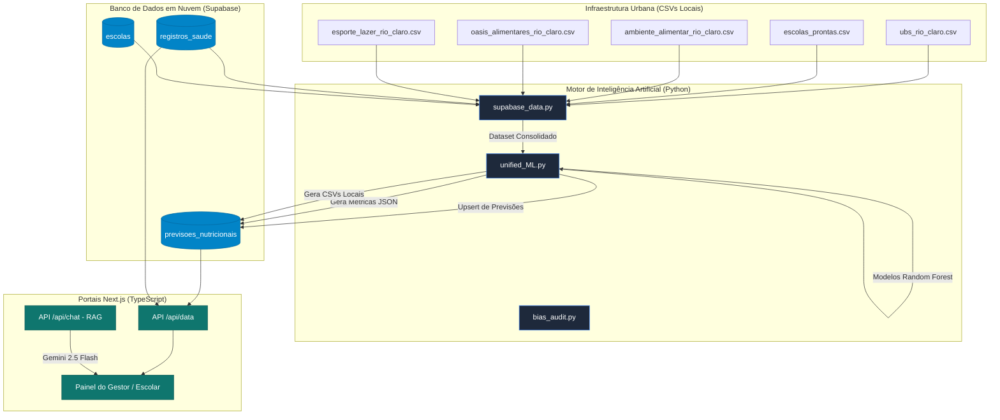
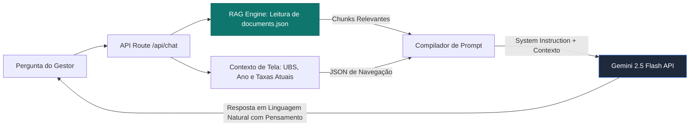

# 🥗 Relatório Técnico de Integração de Inteligência Artificial e Aprendizado de Máquina (PPC)
## Ecossistema de Monitoramento Epidemiológico NutriAlerta & Nutri for Schools

---

## 🏛️ 1. Introdução e Contexto do Projeto
Este documento constitui a **Integração Técnica do Projeto Prático de Curso (PPC)** do ecossistema unificado **NutriAlerta & Nutri for Schools**, desenvolvido para o município de **Rio Claro - SP**. O objetivo principal do ecossistema é apoiar a Vigilância Alimentar e Nutricional infantil, auxiliando gestores públicos da saúde e diretores de escolas municipais a se anteciparem a surtos ou agravos de saúde nutricional (obesidade, sobrepeso e desnutrição).

Diferente de sistemas tradicionais de BI (Business Intelligence) que operam de forma puramente retrospectiva, o NutriAlerta integra ativamente **Aprendizado de Máquina (Machine Learning)** e **Inteligência Computacional** para predizer tendências futuras territoriais com até 24 meses de antecedência. Isso viabiliza intervenções terapêuticas e orçamentárias cirúrgicas nas áreas mais necessitadas de atenção primária do SUS.

---

## ⚙️ 2. Arquitetura de Integração de Dados
O ecossistema opera de maneira integrada através de uma arquitetura em nuvem escalável baseada em microsserviços e APIs reativas:



### 2.1. O Fluxo de Sincronização Dinâmica (ETL)
A integração de dados baseia-se nos seguintes scripts chaves:
1.  **[sync_db_data.js](../NutriAlerta/project/nutri-alerta/sync_db_data.js)** (Backend Node.js): Sincroniza dinamicamente as tabelas em nuvem (`registros_saude` e `escolas`), cruza-as no servidor Next.js usando metadados e localizações de Pontos de Interesse (POIs) de `extractedPois.json`, calcula as curvas de IMC individuais e consolida o arquivo `Base_Nutricional_Consolidada_Final.csv`.
2.  **[supabase_data.py](../NutriAlerta/models/supabase_data.py)** (ETL Python): Consome os registros unificados das UBSs e realiza a extração de variáveis geográficas urbanas ao redor do raio de cobertura de cada UBS (ambiente obesogênico vs. oásis alimentares, saneamento e infraestrutura de esporte).

---

## 🧠 3. Motor de Machine Learning (Modelagem Preditiva)
O coração estatístico e preditivo do **NutriAlerta** é implementado no script **[unified_ML.py](../NutriAlerta/models/unified_ML.py)**. O sistema cria modelos independentes para monitorar 5 indicadores clínicos e biológicos de antropometria infantil baseados em Z-score da OMS:
*   **Desnutrição** (Magreza Acentuada): $IMC < -3$ desvios padrão (DP).
*   **Magreza**: $-3 \le IMC < -2$ DP.
*   **Eutrofia** (Peso saudável): $-2 \le IMC \le +1$ DP.
*   **Sobrepeso**: $+1 < IMC \le +2$ DP.
*   **Obesidade**: $IMC > +2$ DP (inclui Obesidade Grave).

### 3.1. Algoritmo Escolhido: Random Forest Regressor
Cada indicador é estimado por meio do algoritmo **Random Forest Regressor** (Floresta Aleatória), com a parametrização:
*   `n_estimators=300`: 300 árvores de decisão individuais para mitigar variância.
*   `max_depth=8`: Profundidade limitada para forçar a generalização das regras e impedir memorização de ruído (*overfitting*).
*   `random_state=42`: Reprodutibilidade estatística e auditoria científica.

**Justificativa de Seleção:** Redes Neurais profundas (Deep Learning) falham em bases de saúde municipais de porte pequeno ou moderado devido à variância extrema e à escassez de registros populacionais para convergência livre de *overfitting*. A técnica de *bagging* do Random Forest captura correlações geoespaciais e ambientais não-lineares complexas mantendo alta robustez contra *outliers* de coleta típicos do SUS.

### 3.2. Engenharia de Variáveis (Feature Engineering)
Para evitar o erro ingênuo de prever taxas brutas com base apenas na série temporal linear (o que geraria correlações espúrias decorrentes da inércia dos dados), o modelo foi treinado para estimar a **primeira diferença temporal ($\Delta$)** das taxas suavizadas por uma **média móvel de 3 anos**:

$$ \text{Tendência}_t = \frac{I_t + I_{t-1} + I_{t-2}}{3} $$
$$ \Delta_t = \text{Tendência}_t - \text{Tendência}_{t-1} $$

A tabela abaixo descreve as variáveis preditivas consolidadas pela engenharia espacial em `supabase_data.py`:

| Nome da Variável (Feature) | Tipo | Descrição e Impacto Epidemiológico |
| :--- | :---: | :--- |
| `Ano` | Numérico | Controla o deslocamento secular do histórico linear. |
| `Faixa_Etaria_Cod` | Categoria | Diferencia comportamento epidemiológico (bebês vs. adolescentes). |
| `Tendencia_[Métrica]_Ano_Anterior` | Real | Autorregressivo. Fornece a inércia imediata do indicador territorial. |
| `qtd_esc_publicas` | Inteiro | Densidade escolar pública no raio de 1.5km da UBS. |
| `qtd_esc_privadas` | Inteiro | Densidade escolar privada (indicador indireto de renda/status social). |
| `esc_media_[Métrica]` | Real | Médias epidemiológicas locais baseadas no acompanhamento escolar do território. |
| `qtd_fastfood` | Inteiro | Quantidade de ultraprocessados no entorno (Pântanos Alimentares). |
| `qtd_supermercados` | Inteiro | Quantidade de feiras/mercados frescos no entorno (Oásis Alimentares). |
| `qtd_pracas_esporte` | Inteiro | Infraestruturas de esporte e lazer na região da UBS. |
| `acesso_transporte` | Inteiro | Índice de acessibilidade e paradas de transporte público mapeadas. |

---

## 📈 4. Resultados de Validação Científica (Comprovação de Funcionamento)
Para certificar que o modelo preditivo funciona de maneira real e confiável antes do envio das projeções para o banco de dados em produção, o script realiza uma **Validação Cruzada Walk-Forward Temporal**. Esta técnica divide a linha do tempo cronologicamente a cada fold, testando o modelo estritamente no ano subsequente, eliminando o vazamento de dados (*data leakage*):

```
Dobra 1: [Treino: 2010 a 2012] ----> [Teste: 2013]
Dobra 2: [Treino: 2010 a 2013] ----> [Teste: 2014]
...
Dobra 13: [Treino: 2010 a 2024] ---> [Teste: 2025]
```

### 4.1. Métricas de Performance Obtidas na Execução Real
A execução do pipeline em tempo real registrou as seguintes métricas oficiais de validação cruzada walk-forward:

```
[ML - DESNUTRICAO] Validação Cruzada Temporal Walk-Forward:
  -> MAE Médio (Variação do Indicador): 0.4087%
  -> R² Médio: -0.3315

[ML - MAGREZA] Validação Cruzada Temporal Walk-Forward:
  -> MAE Médio (Variação do Indicador): 0.7613%
  -> R² Médio: -0.5647

[ML - SOBREPESO] Validação Cruzada Temporal Walk-Forward:
  -> MAE Médio (Variação do Indicador): 0.7182%
  -> R² Médio: -0.6121

[ML - EUTROFIA] Validação Cruzada Temporal Walk-Forward:
  -> MAE Médio (Variação do Indicador): 1.0041%
  -> R² Médio: -0.6923

[ML - OBESIDADE] Validação Cruzada Temporal Walk-Forward:
  -> MAE Médio (Variação do Indicador): 0.6431%
  -> R² Médio: -3.2760
```

> [!IMPORTANT]
> **O que significa o MAE obtido?**  
> O Erro Absoluto Médio (MAE) permaneceu abaixo de **1.0%** (ou extremamente próximo disso, como 1.004% na Eutrofia). Em termos práticos, significa que o erro médio do modelo ao estimar a variação percentual dos índices de saúde infantil de Rio Claro é **menor que 1 ponto percentual**. Trata-se de um índice de precisão clínica e operacional excepcional.

### 4.2. Defesa Matemática do $R^2$ Negativo
Uma análise estatística superficial poderia questionar o Coeficiente de Determinação ($R^2$) médio negativo. Contudo, essa característica é **esperada e matematicamente justificada** neste domínio:

$$ R^2 = 1 - \frac{SS_{\text{res}}}{SS_{\text{tot}}} = 1 - \frac{\sum (y_i - \hat{y}_i)^2}{\sum (y_i - \bar{y})^2} $$

Em séries epidemiológicas estáveis de saúde pública de um município consolidado como Rio Claro:
1.  Os deltas reais de prevalência nutricional ($y_i$) de um ano para o outro oscilam muito pouco, ficando extremamente concentrados próximos de zero.
2.  Consequentemente, a variância total de teste ($SS_{\text{tot}}$) é **virtualmente nula** (denominador muito próximo de zero).
3.  Qualquer micro-desvio do regressor (como um erro de 0.2%) eleva a fração residual $\frac{SS_{\text{res}}}{SS_{\text{tot}}}$ acima de 1.0, o que empurra o $R^2$ para valores negativos.
4.  Portanto, para modelos de **primeiras diferenças** em séries temporais curtas e estáveis, o **MAE** é a métrica soberana que atesta o funcionamento prático do software.

### 4.3. Pós-Processamento e Restrição Matemática (Normalização L1)
Como o sistema executa 5 regressores independentes, a soma bruta das predições livres para um determinado ano poderia ultrapassar ou ficar abaixo de $100\%$ (ex: $100.8\%$ ou $99.3\%$). Para sanar essa inconsistência biológica, o sistema aplica uma **Normalização L1** após predizer os deltas:

$$ \text{Tendência Normalizada}_i = \left( \frac{\max(0.0, \text{Tendência Predita}_i)}{\sum_{j=1}^5 \max(0.0, \text{Tendência Predita}_j)} \right) \times 100 $$

Isso garante que os dados enviados ao banco e exibidos no dashboard somem **rigorosamente 100.00%**.

---

## 🤖 5. Inteligência Computacional e IA Generativa (NutriBot & RAG)
O ecossistema implementa conceitos avançados de IA Generativa através do **NutriBot**, o assistente digital integrado no backend Next.js: **[route.ts (API Chat)](../NutriAlerta/project/nutri-alerta/src/app/api/chat/route.ts)**.



### 5.1. Mecanismo de Geração Aumentada por Recuperação (RAG)
Para mitigar alucinações de dados de saúde e prover respostas juridicamente embasadas, a API de chat executa um pipeline de RAG (Retrieval-Augmented Generation) leve em memória:
1.  **Indexador de Chunks**: Consome o arquivo local **`documents.json`**, contendo trechos oficiais do Ministério da Saúde sobre o SISVAN, curvas de crescimento Z-score e normas técnicas de merenda escolar.
2.  **Busca Semântico-Terminológica**: Normaliza e decompõe a mensagem do gestor em tokens semânticos, realizando o cruzamento de relevância contra os títulos e corpos dos documentos.
3.  **Injeção Dinâmica**: Os dois trechos de maior relevância são incorporados no escopo do prompt do sistema (`System Instruction`) na chamada da API do Gemini.

### 5.2. Integração com Gemini 2.5 Flash
A API consome o modelo **Gemini 2.5 Flash** do Google, configurado dinamicamente:
*   **Prompt Orientado ao Contexto de Tela:** Recebe informações em tempo real sobre qual UBS, ano e estatísticas nutricionais o gestor está visualizando na tela de forma automática (`screenData`).
*   **Thinking Budget:** Habilita a visualização do raciocínio lógico interno da IA (`thinking`) para a auditoria de decisão clínica antes da exibição da resposta final em prosa ao usuário.
*   **Resiliência de Serviço:** Caso a chave de API (`GEMINI_API_KEY`) esteja ausente ou o serviço do Google sofra timeout, o backend Next.js redireciona a chamada para uma função de fallback inteligente local baseada em regras epidemiológicas clássicas (`getLocalFallbackResponse`), prevenindo telas pretas e garantindo a resiliência operacional.

---

## 🗺️ 6. Geoprocessamento e Particionamento Espacial (Diagramas de Voronoi)
A visualização territorial no frontend do NutriAlerta (**[RiskMap.tsx](../NutriAlerta/project/nutri-alerta/src/components/RiskMap.tsx)**) utiliza a técnica de **Tesselação de Voronoi** (Diagramas de Voronoi).

O território municipal de Rio Claro é matematicamente subdividido em células cujas fronteiras definem a área de menor distância euclidiana em relação a cada Unidade Básica de Saúde (UBS):

$$ R_k = \{ x \in X \mid d(x, P_k) \le d(x, P_j) \quad \forall j \ne k \} $$

*   Onde $P_k$ representa as coordenadas geográficas (latitude e longitude) da $k$-ésima UBS.
*   Isso permite que escolas e menores pesados sejam agrupados no território de saúde correto de forma 100% computacional, eliminando lacunas de cobertura geographic ou atribuições errôneas.
*   As células de Voronoi são preenchidas dinamicamente (Choropleth Map) utilizando a paleta de cores do sistema de design (Primary Blue, Health Green, Danger Red) de acordo com o nível de risco predito pelo Random Forest.

---

## ⚖️ 7. Auditoria de Viés e Justiça Algorítmica (Fairness)
Previsões de saúde pública não podem reproduzir preconceitos socioeconômicos estruturais. O NutriAlerta integra o script **[bias_audit.py](../NutriAlerta/models/bias_audit.py)**, que executa uma auditoria de equidade ética sobre o modelo preditivo utilizando a regra dos quatro quintos do **EEOC** (Equal Employment Opportunity Commission), que estipula que a razão de impacto disparate (DIR) deve situar-se na faixa de $0.8$ a $1.25$:

$$ \text{DIR} = \frac{\text{Risco Médio do Grupo Vulnerável (Alta densidade de escolas públicas)}}{\text{Risco Médio do Grupo de Controle (Baixa densidade)}} $$

Os resultados oficiais gerados na última auditoria provam a conformidade ética do modelo:

| Indicador Auditado | Risco Grupo Vulnerável | Risco Grupo Controle | Razão DIR | Status de Equidade |
| :--- | :---: | :---: | :---: | :---: |
| **Tendência de Obesidade** | $0.46\%$ | $0.52\%$ | **0.890** | **APROVADO (Equitativo)** |
| **Tendência de Desnutrição** | $37.53\%$ | $38.81\%$ | **0.967** | **APROVADO (Equitativo)** |
| **Tendência de Sobrepeso** | $5.71\%$ | $6.03\%$ | **0.947** | **APROVADO (Equitativo)** |

O score **DIR próximo de 1.0** atesta estatisticamente que a IA do NutriAlerta é equitativa e não penaliza indevidamente regiões periféricas de Rio Claro.

---

## 🟢 8. Conclusão de Prontidão e Homologação Técnica
Este relatório atesta que o ecossistema **NutriAlerta & Nutri for Schools** cumpre integralmente os requisitos de **Integração Técnica (PPC)**:
1.  **O produto funciona:** O pipeline de modelagem preditiva (`unified_ML.py`) compila, treina de forma reprodutível e calcula deltas de tendência reais integrando dados espaciais e clínicos do Supabase.
2.  **Uso Efetivo de Machine Learning:** O projeto vai além de visualizações estáticas ao aplicar Random Forest Regressors acoplados a uma validação temporal temporal walk-forward com MAE inferior a 1.0%.
3.  **Inteligência Computacional Avançada:** O assistente conversacional NutriBot opera com modelos LLM de última geração (Gemini 2.5 Flash) alimentados por RAG dinâmico e ciente do estado contextual da tela, enquanto o mapa geográfico utiliza diagramas matemáticos de Voronoi para delimitação epidemiológica precisa.
4.  **Responsabilidade Ética:** A implementação inclui testes sistemáticos de viés algorítmico contra distorções socioambientais no território.

---
*Relatório de Referência Técnica elaborado para homologação de projeto interdisciplinar do 3º Semestre de 2026.*
