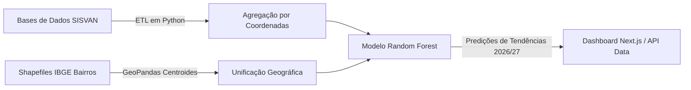

# 📊 NutriAlerta — Portal de Vigilância Nutricional Preditiva
> **Mapeamento geoespacial e inteligência artificial para o direcionamento de recursos community-health em Rio Claro - SP.**  
> *Componente de Mapeamento Municipal do Ecossistema NutriAlerta*

---

## 💡 Proposta do NutriAlerta
O **NutriAlerta** é um portal estratégico de tomada de decisões para **Gestores Municipais de Saúde Pública**. A partir da consolidação de registros demográficos, séries históricas do SISVAN e cadastros de saúde, a plataforma fornece previsões baseadas em aprendizado de máquina para direcionar ações comunitárias preventivas, busca ativa de desnutrição e combate à obesidade infantil.

---

## 🌟 Funcionalidades Principais

1.  **Mapeamento Geoespacial de Risco (Voronoi & Choropleth):**
    *   Visualização da prevalência nutricional por bairros de Rio Claro.
    *   Geração de polígonos de Voronoi dinâmicos para representar as zonas de abrangência de cada uma das **18 Unidades Básicas de Saúde (UBS)**.
    *   Destaque interativo de indicadores críticos (Obesidade, Desnutrição, Sobrepeso, Eutrofia).
2.  **Modelo Preditivo de Machine Learning (Random Forest):**
    *   Algoritmo treinado com dados demográficos e séries históricas.
    *   Previsões de prevalência e variações (*deltas*) projetadas para os anos de **2026 e 2027**, indicando quais bairros tendem a sofrer pioras nos índices nutricionais.
3.  **HUD Reativa Municipal & Comparador de UBSs:**
    *   Consolidação em tempo real dos dados baseada nas escolas do território (~8.5K alunos avaliados em 2025).
    *   Tabelas comparativas de taxas de prevalência entre unidades de saúde para identificar disparidades regionais.
4.  **NutriBot (Assistente de Decisão Epidemiológica):**
    *   Chatbot embarcado alimentado com o modelo **Gemini 1.5/3.5**, que consome o contexto epidemiológico ativo (ano selecionado, taxas regionais de prevalência e índices preditos).
    *   Ajuda gestores a desenharem relatórios, interpretarem dados de risco e formularem políticas públicas.
5.  **Acesso Seguro e Interface Premium:**
    *   Autenticação robusta integrada via **Supabase Auth**.
    *   Interface com suporte completo a **Modo Escuro (Dark Mode)**, com o botão de controle de tema estrategicamente posicionado no canto superior direito do cabeçalho.

---

## 🛠️ Stack Tecnológica

*   **Framework principal:** Next.js (com roteamento App Router)
*   **Visualização de Dados:** Recharts (Gráficos temporais e de distribuição)
*   **Cartografia:** Leaflet e React-Leaflet (Mapas interativos)
*   **Gerenciador de Estado:** Zustand (Sincronização global de seleção de UBS, ano e indicador)
*   **Banco de Dados & Autenticação:** Supabase
*   **IA Generativa:** Gemini API (Google Generative AI SDK)
*   **Animações:** Framer Motion (Transições fluidas e interfaces dinâmicas)

---

## 📋 Integrantes do Time
*   **Scrum Master:** Gabriel Vinicios Nanetti
*   **Product Owner:** Nathan Scremin
*   **Dev Team:** Nicolas Ferreira, Arthur Araujo Leite, Pedro Henrique Carvalho, Matheus Henrique Domingos

---

## 🚀 Como Executar o App

1.  **Navegue até a pasta do aplicativo:**
    ```bash
    cd project/nutri-alerta
    ```
2.  **Instale as dependências:**
    ```bash
    npm install
    ```
3.  **Configure o arquivo `.env.local` na pasta do app:**
    ```env
    # Conectividade Supabase
    NEXT_PUBLIC_SUPABASE_URL=seu-url-supabase
    NEXT_PUBLIC_SUPABASE_ANON_KEY=sua-chave-anon-supabase

    # Administração & Autenticação
    SUPABASE_ADMIN_EMAIL=email-do-admin-do-supabase
    SUPABASE_ADMIN_PASSWORD=senha-do-admin-do-supabase

    # Criptografia de Dados Confidenciais (LGPD)
    ENCRYPTION_KEY=sua-chave-aes-256-com-exatamente-32-caracteres
    HASH_SALT=seu-salt-para-hashes-hmac

    # IA Generativa (NutriBot)
    GEMINI_API_KEY=sua-chave-api-gemini
    ```
4.  **Execute o servidor de desenvolvimento:**
    ```bash
    npm run dev
    ```
    *O aplicativo rodará na porta padrão `3000` (http://localhost:3000).*

---

## 🔒 Governança de Dados, LGPD & Resiliência
*   **Zero Credenciais no Cliente**: Remoção de chaves administrativas e blocos de signup inseguros do frontend. A integridade das sessões é controlada de forma estrita no servidor.
*   **Criptografia Simétrica (AES-256-CBC)**: Criptografia robusta na ingestão de dados de menores no banco, garantindo conformidade legal à LGPD.
*   **Conexão Defensiva**: Timeouts programados de 5 segundos no portal e no dashboard garantem uma interface fluida com alternativas rápidas de recarga caso o servidor demore a responder.
*   **Conectividade do Chat**: O widget de chat analisa erros HTTP ativamente para manter a indicação do sinal "Online" ou "Offline" sempre fidedigna.

---

## 📈 Precisão Clínica (WHO Z-Score)
Abandonamos limites de IMC estáticos obsoletos. O sistema adota a classificação baseada na **Curva de Crescimento e Desvio Padrão (DP) IMC-para-idade da OMS (Z-score)** de 0 a 18 anos por sexo, garantindo triagens clínicas sem margem de erro.

---

## 🛠️ Validação e Build de Produção
*   **Type-check estático**:
    ```bash
    npm run type-check
    ```
*   **Next.js Production Build**:
    ```bash
    npm run build
    ```
    *Concluídos com absoluto sucesso e zero erros.*

---

## 🔄 Fluxo de Processamento de Dados (ETL & ML)


