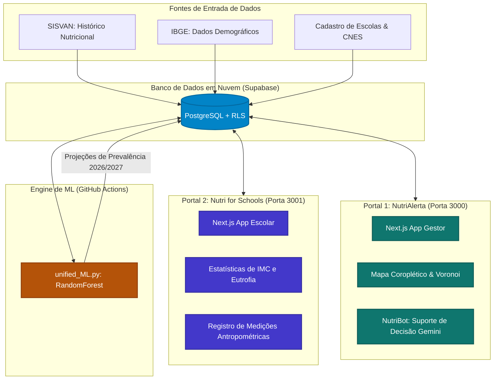

# 🥗 Ecossistema NutriAlerta & Nutri for Schools
> **Mapeamento Epidemiológico, Gestão de Saúde Coletiva e Inteligência Artificial Preditiva**  
> *Projeto Interdisciplinar do 3º Semestre · FATEC Rio Claro · Saúde Pública & Inovação Tecnológica · Versão de Produção*

[](https://nextjs.org/)
[](https://www.typescriptlang.org/)
[](https://www.python.org/)
[](https://supabase.com/)
[](https://scikit-learn.org/)
[](https://vercel.com/)

O **NutriAlerta** é um ecossistema integrado de saúde pública e tecnologia que une análise de dados reais, mapeamento geoespacial interativo e inteligência artificial preditiva (*Random Forest*) para transformar a prevenção e o combate à desnutrição e à obesidade infantil na rede de ensino de **Rio Claro - SP**.

---

## 🏛️ Visão Geral e Arquitetura do Ecossistema

O ecossistema divide-se em duas vertentes interdependentes que atuam em perfeita sintonia e segurança por meio de um banco de dados integrado Supabase na nuvem:

1. **NutriAlerta (Portal do Gestor Municipal):** Painel analítico de alta performance para gestores públicos de saúde e analistas, contendo mapas epidemiológicos coropléticos, diagramas de Voronoi, projeções preditivas a dois anos e o assistente de decisão inteligente **NutriBot** (integrado ao Google Gemini).
2. **Nutri for Schools (Portal Escolar/Coletor):** Interface dedicada e simplificada para as escolas do município realizarem o cadastro antropométrico (peso, altura e classificação de IMC pela OMS) dos alunos de forma rápida e segura.



---

## 👥 A Equipe (Scrum Framework)

O desenvolvimento seguiu rigorosamente os ritos ágeis do framework **Scrum**, estruturado em sprints quinzenais, dailies assíncronas e controle rígido de Definition of Done (DoD) para garantir código limpo e homologado:

*   **Scrum Master:** Gabriel Vinicios Nanetti *(Gestão ágil, facilitação e conformidade ágil)*
*   **Product Owner:** Nathan Scremin *(Visão de produto, priorização do backlog de valor e validação)*
*   **Dev Team (Desenvolvimento, Engenharia de Dados & Machine Learning):**
    *   Nicolas Ferreira da Silva
    *   Arthur Araujo Leite
    *   Pedro Henrique Carvalho de Paula
    *   Matheus Henrique Domingos da Silva

---

## 📁 Estrutura do Repositório & Dossiê Técnico

O repositório está organizado como um **Monorepo Híbrido** sem espaços em pastas chave para total compatibilidade com pipelines de integração contínua (CI/CD) e hospedagem moderna na nuvem:

```bash
NutriAlerta/                   # Raiz do Repositório
├── .github/workflows/         # Automação CI/CD
│   └── run_ml.yml             # Pipeline gratuito da IA (GitHub Actions)
│
├── NutriAlerta/               # 1. Sistema do Gestor Municipal (Porta 3000)
│   ├── models/                # Algoritmos e Motor de IA em Python
│   │   ├── unified_ML.py      # Core de ML: RandomForest & Persistência no Supabase
│   │   ├── supabase_data.py   # Interface de dados e snapshot com Supabase
│   │   └── diag_data.py       # Utilitário de auditoria do banco de dados na nuvem
│   └── project/
│       ├── csv/               # Históricos e backups das projeções da IA
│       └── nutri-alerta/      # Aplicação Next.js (Dashboard do Gestor)
│
├── Nutri for Schools/         # 2. Portal de Pesagem Escolar (Porta 3001)
│   └── project/
│       └── nutri-alerta/      # Aplicação Next.js (Coletor Escolar)
│
├── iniciar_servidores.bat     # Utilitário para inicialização local automática
├── documentacao_modelo_IA.md  # Dossiê acadêmico e científico da Inteligência Artificial
├── guia_deploy_nuvem.md       # Guia oficial passo-a-passo para deploy na Vercel e Actions
└── roteiro_apresentacao_10min.md # Roteiro de slides e Q&A para apresentação do projeto
```

### 📚 Documentos Técnicos Relevantes:
*   📖 **[Dossiê do Modelo de IA](documentacao_modelo_IA.md):** Fundamentação científica da escolha do Random Forest Regressor, validação cruzada temporal *Walk-Forward*, cálculo matemático dos deltas nutricionais e normalização L1.
*   📖 **[Guia Oficial de Deploy Nuvem](guia_deploy_nuvem.md):** Passo a passo para configurar as chaves de segurança (Secrets) nas duas instâncias da Vercel e orquestrar a automação do pipeline.
*   📖 **[Roteiro de Apresentação de 10 Minutos](roteiro_apresentacao_10min.md):** Estrutura minuto a minuto de slides e guia de defesa contra perguntas difíceis da banca examinadora.

---

## ⚡ Como Executar Localmente

### Pré-requisitos
*   **Node.js** (versão 18 ou superior)
*   **Python** (versão 3.10 ou superior) com dependências (`numpy`, `pandas`, `scikit-learn`, `requests`) instalado.
*   Banco de dados **Supabase** configurado (credenciais mapeadas no arquivo `.env.local` na raiz de cada projeto).

### Inicialização Automatizada (Recomendado)
Para maior praticidade em demonstrações locais, o projeto conta com um script em lote que instala dependências de desenvolvimento ausentes e inicia os dois portais simultaneamente nas portas apropriadas. Basta dar dois cliques ou rodar no terminal na raiz do repositório:
```bash
./iniciar_servidores.bat
```

### Inicialização Manual
1.  **Portal do Gestor (NutriAlerta - Porta 3000):**
    ```bash
    cd "NutriAlerta/project/nutri-alerta"
    npm install
    npm run dev
    ```
2.  **Portal Escolar (Nutri for Schools - Porta 3001):**
    ```bash
    cd "Nutri for Schools/project/nutri-alerta"
    npm install
    npm run dev
    ```

---

## 🔒 Segurança, LGPD & Privacidade (Conformidade Total)

A engenharia do ecossistema NutriAlerta foi desenhada sob os pilares de **Privacy by Design** e em total conformidade com a **Lei Geral de Proteção de Dados (LGPD)**:

1.  **Zero Credenciais Expostas**: Nenhuma chave de banco de dados, privilégio administrativo ou credencial de IA está exposta no histórico do git. A validação é isolada no servidor via variáveis de ambiente robustas.
2.  **Pseudonimização Criptográfica (SHA-256 HMAC)**: Dados sensíveis de menores de idade, como o CPF das crianças na pesagem, são submetidos a hash irreversível utilizando chave secreta municipal antes de serem persistidos no banco de dados.
3.  **Criptografia Simétrica Avançada (AES-256-GCM)**: Nomes de alunos e responsáveis são criptografados a nível de servidor, impossibilitando a identificação dos menores mesmo em cenários extremos de vazamento do banco de dados.
4.  **Bypass Seguro de Segurança RLS**: A comunicação do motor de ML e das APIs administrativas ocorre por conexões JWT seguras com a conta de serviço `nutrialerta@gmail.com`, permitindo o fluxo seguro de dados públicos sem comprometer a integridade do banco.
