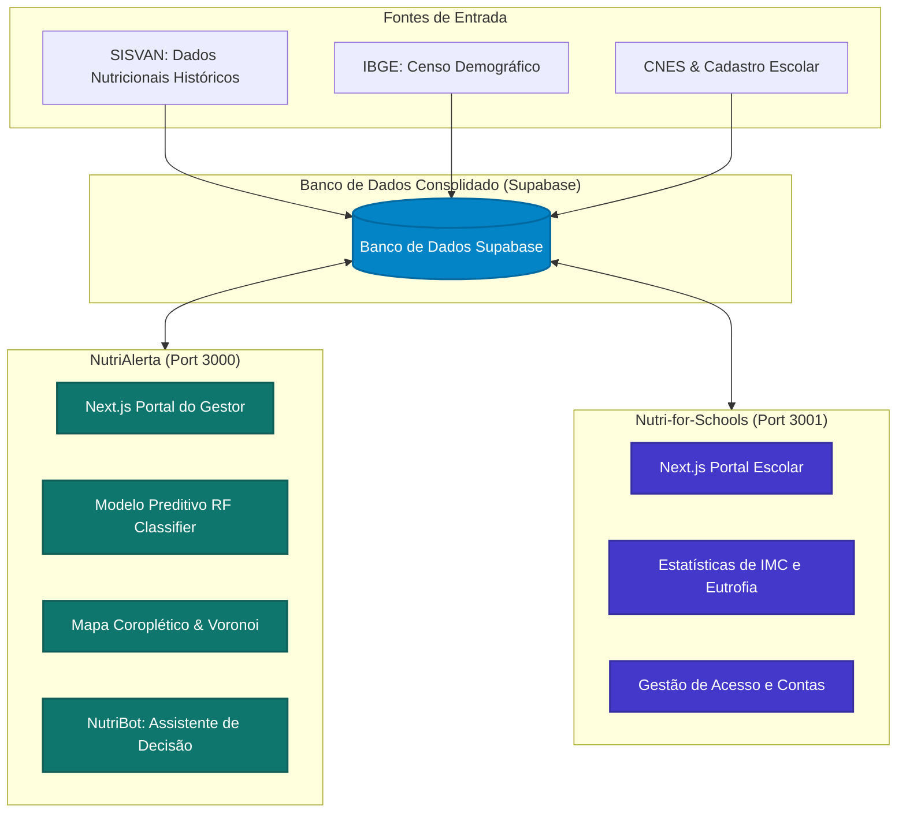

# 🥗 Ecossistema NutriAlerta & Nutri-for-Schools
> **Mapeamento Epidemiológico e Gestão de Saúde Nutricional Escolar**  
> *Projeto Interdisciplinar do 3º Semestre · FATEC Rio Claro · Saúde Pública · Versão Homologada*

Este repositório unifica duas soluções complementares baseadas em dados reais de saúde e aprendizado de máquina (*Random Forest*) para transformar o acompanhamento nutricional da população infantil de **Rio Claro - SP**.

---

## 👥 Equipe do Projeto (Scrum Framework)
O desenvolvimento seguiu rigorosamente as práticas ágeis do Scrum, com sprints quinzenais, dailies assíncronas e controle estrito de Definition of Done (DoD) para garantir qualidade extrema:

*   **Scrum Master:** Gabriel Vinicios Nanetti (Gestão ágil, coordenação de rituais, conformidade e facilitação)
*   **Product Owner:** Nathan Scremin (Visão de produto, priorização do backlog de alto valor, validação)
*   **Dev Team (Desenvolvimento, Engenharia de Dados & Machine Learning):**
    *   Nicolas Ferreira da Silva
    *   Arthur Araujo Leite
    *   Pedro Henrique Carvalho de Paula
    *   Matheus Henrique Domingos da Silva

---

## 🏛️ Visão Geral do Ecossistema

O ecossistema divide-se em duas vertentes interdependentes que atuam em sintonia por meio de um banco de dados integrado Supabase:



---

## 📁 Estrutura de Diretórios e Dossiê de Artefatos

O repositório está estruturado de forma limpa e padronizada sem espaços nas pastas para garantir compatibilidade completa com deploys em nuvem (Vercel/AWS):

```bash
NutriAlerta/            # Repositório Principal
├── Artifacts/          # Dossiê de Documentos Oficiais do Showcase
│   ├── PRD_Final.md    # PRD Final unificado + Checklist de Ética, LGPD e IA
│   ├── Documentacao_Tecnica.md  # Arquitetura, ML Engine, Segurança e Sincronização
│   ├── Guia_Deploy_Nuvem.md     # Guia prático de Deploy duplo na Vercel e Actions
│   └── Roteiro_Pitch_Showcase.md # Script de ensaio do Pitch de 3 minutos para Empresas
│
├── NutriAlerta/        # 1. Sistema do Gestor Público (Portal Municipal)
│   ├── project/
│   │   ├── csv/        # Bases históricas e projeções preditivas (.csv)
│   │   └── nutri-alerta/   # Código do app Next.js (Dashboard do Gestor - Porta 3000)
│   └── collector/      # Script raspador/coletor independente
│
└── Nutri-for-Schools/  # 2. Portal Escolar Individual (Acompanhamento Local)
    ├── project/
    │   ├── csv/
    │   └── nutri-alerta/   # Código do app Next.js (Dashboard da Escola - Porta 3001)
    └── collector/
```

### 🏫 1. [Dossiê de Artefatos (Artifacts)](file:///c:/Users/nathan.scremin/Documents/GitHub/NutriAlerta/Artifacts)
Reúne toda a documentação acadêmica e profissional de entrega exigida para as empresas parceiras no **Showcase FATEC**:
*   [PRD Consolidado & Ética](file:///c:/Users/nathan.scremin/Documents/GitHub/NutriAlerta/Artifacts/PRD_Final.md): O escopo, rituais Scrum, backlog final de histórias e a Checklist de Ética, LGPD e Segurança sob a ótica de IA regulamentada.
*   [Documentação Técnica](file:///c:/Users/nathan.scremin/Documents/GitHub/NutriAlerta/Artifacts/Documentacao_Tecnica.md): Mapeamento de tabelas do banco Supabase, pipeline preditivo *Random Forest*, proteção de menores de idade e Single Sign-On (SSO) cross-port.
*   [Guia de Deploy Nuvem](file:///c:/Users/nathan.scremin/Documents/GitHub/NutriAlerta/Artifacts/Guia_Deploy_Nuvem.md): Passo a passo para configurar as variáveis de ambiente e manter o deploy duplo integrado 100% gratuito.
*   [Roteiro de Pitch](file:///c:/Users/nathan.scremin/Documents/GitHub/NutriAlerta/Artifacts/Roteiro_Pitch_Showcase.md): Script de ensaio geral cronometrado em 3 minutos para encantar os representantes de empresas parceiras.

---

## 🚀 Como Executar Localmente

### Pré-requisitos
*   **Node.js** (versão 18 ou superior)
*   **npm** ou **yarn**
*   **Supabase** (configurado com as variáveis de ambiente corretas)

### Executando Simultaneamente via Script Automatizado
Para sua maior comodidade de demonstração local, criamos um script em lote que instala dependências ausentes e inicia os dois servidores de desenvolvimento nas portas correspondentes automaticamente. 
Basta dar dois cliques ou rodar no terminal na raiz do repositório:
```bash
./iniciar_servidores.bat
```

### Executando Manualmente
1.  **NutriAlerta** (Portal do Gestor - Porta 3000):
    ```bash
    cd "NutriAlerta/project/nutri-alerta"
    npm install
    npm run dev
    ```
2.  **Nutri-for-Schools** (Portal Escolar - Porta 3001):
    ```bash
    cd "Nutri-for-Schools/project/nutri-alerta"
    npm install
    npm run dev
    ```

---

## 🔒 Segurança, LGPD & Privacidade (Complacência Total)

A arquitetura do ecossistema passou por um rigoroso processo de conformidade com a **Lei Geral de Proteção de Dados (LGPD)**:
1. **Zero Credenciais Hardcoded**: Toda a comunicação administrativa de banco de dados e inteligência artificial ocorre estritamente em ambiente seguro do servidor (*Server-Side Rendering* e API Routes).
2. **Pseudonimização de Menores (SHA-256 HMAC)**: O CPF dos alunos menores de idade é imediatamente convertido em chaves *hash* aleatórias com salt secreto antes de gravar no banco de dados.
3. **Criptografia Simétrica Avançada (AES-256-GCM)**: Nomes de crianças e responsáveis são protegidos por criptografia no servidor, impedindo o vazamento de informações de identificação em caso de invasões.
