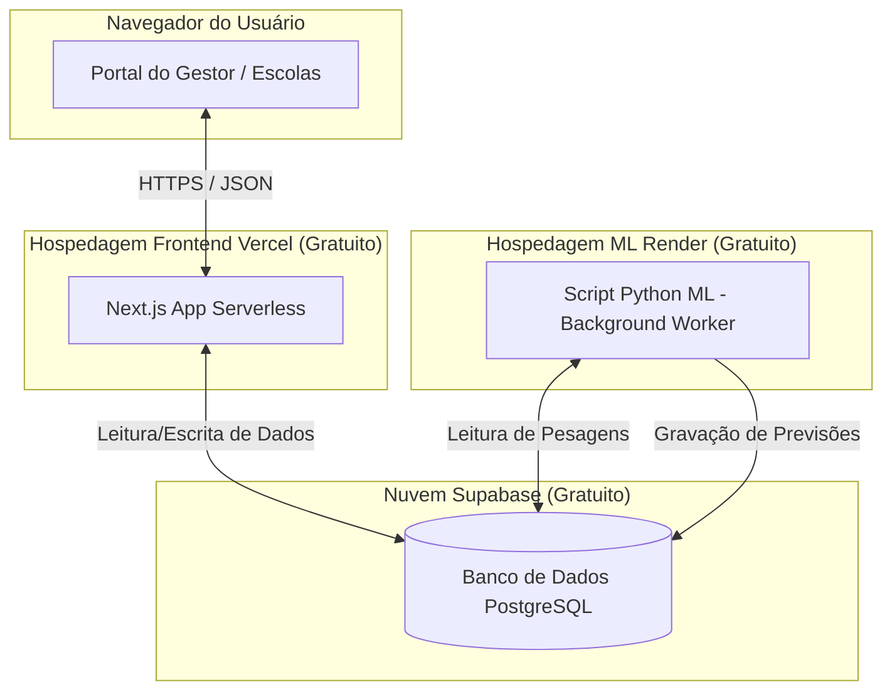

# 🚀 Guia Completo de Deploy na Nuvem (Gratuito & Tempo Real)
> **Como hospedar o Ecossistema NutriAlerta e o Modelo de IA de forma profissional na nuvem**  
> *Projeto Interdisciplinar · 2026*

Este guia técnico detalha a arquitetura ideal e as mudanças necessárias para realizar o deploy público e gratuito de todos os módulos do ecossistema do **NutriAlerta** na nuvem, conectando-se em tempo real ao banco de dados Supabase.

---

## 🏛️ 1. A Arquitetura em Nuvem Ideal
Na nuvem, as responsabilidades de hospedagem devem ser divididas para respeitar a natureza de cada tecnologia de forma gratuita:

1.  **Frontend (Vercel)**: Perfeito para aplicações Next.js. Hospeda o portal municipal (`3000`) e escolar (`3001`) gratuitamente com certificado SSL automático e escalabilidade infinita.
2.  **Banco de Dados (Supabase Cloud)**: Já está na nuvem. A Vercel e o script Python comunicam-se com ele por conexões de rede seguras.
3.  **Pipeline de Machine Learning (Render ou Railway)**: A Vercel **não** suporta scripts Python de execução perpétua (`--watch`) e não tem disco persistente. Usaremos o **Render** (no plano *Background Worker* gratuito) para rodar o pipeline Python.

---

## ⚠️ 2. A Mudança Crítica: Adeus arquivos `.csv` locais!
Atualmente, no ambiente local, o script Python de ML lê/escreve as projeções futuras em arquivos locais como `NutriAlerta_Projecao_Futura.csv`, e o Next.js lê esses arquivos do disco rígido da sua máquina.

**Na nuvem (Vercel), o sistema de arquivos é Somente Leitura (Read-Only) e Temporário.** Se o script Python rodar em outra máquina (Render), a Vercel nunca conseguirá ler esses arquivos `.csv` gerados em disco.

### A Solução Profissional em Tempo Real:
1.  **Criar uma tabela no Supabase** chamada `previsoes_epidemiologicas` (contendo colunas como `cnes`, `ano`, `indicador`, `taxa_predita`, `delta_predito`, etc.).
2.  **No Script Python (`unified_ML.py`)**: Em vez de salvar com `df.to_csv(...)`, mude a linha final para fazer um `INSERT` / `UPSERT` das linhas preditas diretamente nessa nova tabela do Supabase.
3.  **No Next.js (Dashboard)**: Em vez de importar o `.csv` local, faça uma consulta à API do Supabase na tabela `previsoes_epidemiologicas` para puxar os dados.

**Resultado**: O sincronismo fica **100% em tempo real na nuvem**. Uma pesagem nova em uma escola dispara o re-treinamento no Render, que atualiza a tabela no Supabase, refletindo instantaneamente no dashboard hospedado na Vercel!

---

## 🛠️ 3. Passo a Passo do Deploy

### Passo A: Deploy dos Portais Next.js (Vercel)
A Vercel hospeda o repositório diretamente do GitHub com deploy contínuo (qualquer commit atualiza a nuvem automaticamente).

1.  Crie uma conta gratuita em [vercel.com](https://vercel.com) (usando seu login do GitHub).
2.  Clique em **"Add New"** $\rightarrow$ **"Project"** e selecione o seu repositório unificado.
3.  Como temos dois portais em subpastas, você fará **dois projetos separados na Vercel**:
    *   **Projeto 1 (Gestor)**: Defina a *Root Directory* (pasta raiz) como `NutriAlerta/project/nutri-alerta`.
    *   **Projeto 2 (Escolar)**: Defina a *Root Directory* como `Nutri for Schools/project/nutri-alerta`.
4.  No campo **Environment Variables** de cada projeto na Vercel, cadastre as chaves do seu `.env.local`:
    *   `NEXT_PUBLIC_SUPABASE_URL`
    *   `NEXT_PUBLIC_SUPABASE_ANON_KEY`
    *   `GEMINI_API_KEY` (apenas no Gestor)
    *   `ENCRYPTION_KEY`
    *   `HASH_SALT`
    *   `SUPABASE_ADMIN_EMAIL` e `SUPABASE_ADMIN_PASSWORD`
5.  Clique em **"Deploy"**. Seu portal estará online em segundos em uma URL pública (ex: `nutrialerta.vercel.app`)!

---

### Passo B: Deploy do Pipeline de ML (Render)
O **Render** ([render.com](https://render.com)) oferece hospedagem de serviços em segundo plano gratuita.

1.  Crie uma conta no Render (integrada ao GitHub).
2.  Clique em **"New"** $\rightarrow$ **"Background Worker"**.
3.  Selecione o seu repositório.
4.  Configure as definições do serviço:
    *   **Language**: `Python`
    *   **Build Command**: `pip install -r requirements.txt` (crie um arquivo `requirements.txt` listando as dependências `pandas`, `numpy`, `scikit-learn`, `requests` e `supabase`).
    *   **Start Command**: `python NutriAlerta/models/unified_ML.py --watch --interval 300` (roda o loop de monitoramento a cada 5 minutos).
5.  Em **Environment Variables** do Render, adicione as mesmas variáveis de conexão com o Supabase.
6.  Pronto! Seu robô de IA estará rodando na nuvem monitorando o banco de dados.

---

## 📈 4. Comparativo: Local vs. Nuvem com Banco de Dados

| Característica | Funcionamento Local (Atual) | Funcionamento em Nuvem (Deploy) |
| :--- | :--- | :--- |
| **Hospedagem Web** | `localhost:3000` / `3001` (Apenas sua máquina) | URL Pública Vercel Https (Qualquer dispositivo) |
| **Banco de Dados** | Supabase Cloud (Internet) | Supabase Cloud (Internet) |
| **Armazenamento ML** | Arquivo físico `.csv` no seu HD | Tabela Relacional `previsoes` no Supabase |
| **Tempo Real** | **Instantâneo**: monitoramento direto em tempo real. | **Sincronizado**: a IA atualiza a nuvem por demanda. |
| **Persistência** | Perdida se apagar a pasta local. | Segura e protegida por backups automáticos. |
